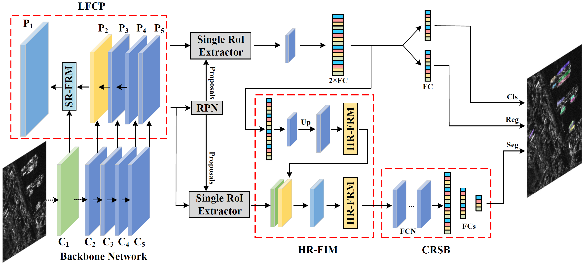

# LFG-Net: Low-level Feature Guided Network for Precise Ship Instance Segmentation in SAR Images
This project hosts the code for reproducing experiment results of LFG-Net  
  
LFG-Net is based on [mmdetection](https://github.com/open-mmlab/mmdetection) framework. Please follow the official guideline of installing the [prerequisites](https://github.com/open-mmlab/mmdetection/blob/master/docs/en/get_started.md/#Installation)  

 
## Highlights
* Small object instance segmentation framework for SAR images. 
* Enhancing the low-level features from image level to instance level.
* LFG-Net achieves `state-of-the-art` instance segmentation performance on `HRSID`, `SSDD`, and `AirSARShip dataset`.
## Requirements
* `ubuntu == 18.04`
* `mmdetection == 2.20`
* `mmcv == 1.4.2`
* `torch-dct`
* `pytorch == 1.7.0`, `torchvision == 0.8.1`
## Usage
### Training 
To train LFG-Net model with original settings of our paper, run:
```
python train.py
```
### Inference
To inference the trained model with a single gpu, run:
```
python tools/test.py <CONFIG_FILE> <DET_CHECKPOINT_FILE> --eval bbox segm
```
## Performance on HRSID
Ship instance segmentation results on HRSID. The models are trained for 12 epochs with the initial learning rate at 0.0025. Results are evaluated with MS COCO evaluation metrics, Parameters, and FPS on Quadaro RTX 6000.
|        Model        |  AP  | AP<sub>50</sub> | AP<sub>75</sub> |  AP<sub>S</sub> |  AP<sub>M</sub> |  AP<sub>L</sub> | Params. |  FPS |
|:-------------------:|:----:|:----:|:----:|:----:|:----:|:----:|:-------:|:----:|
|         SOLO        | 13.8 | 27.8 | 13.8 | 14.2 | 13.6 |  3.8 |  54.92M | 14.2 |
|        Yolact       | 35.3 | 67.2 | 35.2 | 34.1 | 50.0 |  6.2 |  34.73M | 17.3 |
|      Mask R-CNN     | 52.2 | 80.6 | 63.7 | 51.8 | 61.3 |  9.9 |  43.75M | 14.9 |
|      Point Rend     | 53.8 | 81.8 | 65.3 | 53.1 | 63.3 | 15.5 |  55.53M | 12.3 |
|        GRoIE        | 52.0 | 79.7 | 62.8 | 51.4 | 61.1 | 17.5 |  47.54M |  8.3 |
|  Mask Scoring R-CNN | 53.0 | 80.8 | 63.8 | 52.6 | 61.0 | 11.8 |  60.01M | 14.7 |
|      R-ARE-Net      | 53.6 | 80.4 | 65.9 | 55.3 | 55.2 | 13.5 |  46.58M | 10.4 |
|      QueryInst      | 44.2 | 69.5 | 53.2 | 43.4 | 54.6 | 12.2 | 172.22M |  4.5 |
|  Cascade Mask R-CNN | 53.3 | 82.0 | 64.0 | 52.7 | 61.9 | 18.3 |  76.08M | 13.5 |
| Hybrid Task Cascade | 53.6 | 82.3 | 64.7 | 52.8 | 63.2 | 18.6 |  79.73M |  9.7 |
|      Detectors      | 54.1 | 82.4 | 65.5 | 53.3 | 64.2 | 20.7 | 134.00M |  6.3 |
|        SCNet        | 54.4 | 82.4 | 65.9 | 54.1 | 62.1 | 13.2 |  94.29M |  8.6 |
|       LFG-Net       | 59.7 | 88.5 | 72.3 | 59.7 | 64.2 | 11.8 | 116.78M |  6.6 |
|       LFG-Net*      | 63.9 | 90.1 | 76.8 | 63.6 | 69.5 | 42.5 | 174.28M |  5.0 |

 
## Performance on AirSARShip
Ship detection and ship instance segmentation results on AirSARShip dataset. The models are trained for 36 epochs with the initial learning rate at 0.0025. In addition to the MS COCO evaluation metrics, Parameters, and FPS, we also provide the gap between AP<sup>Bbox</sup> and AP<sup>Mask</sup>.
|        Model        |  AP<sup>Bbox</sup>  | AP<sub>50</sub> | AP<sub>75</sub> |  AP<sub>S</sub> |  AP<sub>M</sub> |  AP<sub>L</sub> |  AP<sup>Mask</sup>  | AP<sub>50</sub> | AP<sub>75</sub> |  AP<sub>S</sub> |  AP<sub>M</sub> |  AP<sub>L</sub> | Gap | Params. |  FPS |
|:-------------------:|:----:|:----:|:----:|:----:|:----:|:----:|:----:|:----:|:----:|:----:|:----:|:----:|:----:|:-------:|:----:|
|      Mask R-CNN     | 56.8 | 82.2 | 64.0 | 49.4 | 61.9 |  25.7 |  49.1 | 77.1 | 56.9 | 40.1 | 53.3 | 30.8 |  7.7 |  43.75M | 21.8 |
|      Point Rend     | 58.3 | 83.4 | 67.1 | 50.0 | 63.7 |  29.7 |  54.1 | 80.5 | 64.0 | 41.6 | 59.0 | 40.9 |  4.2 |  55.53M | 20.1 |
|        GRoIE        | 57.5 | 82.0 | 66.3 | 49.2 | 62.9 |  28.2 |  51.4 | 78.7 | 59.9 | 40.7 | 55.8 | 37.2 |  6.1 |  47.54M | 10.3 |
|  Mask Scoring R-CNN | 58.0 | 83.1 | 66.1 | 55.0 | 63.0 |  32.2 |  49.4 | 77.6 | 56.5 | 39.3 | 53.6 | 34.0 |  8.6 |  60.01M | 20.8 |
|      R-ARE-Net      | 56.6 | 83.3 | 64.8 | 49.0 | 61.9 |  31.5 |  53.8 | 80.4 | 63.8 | 46.4 | 58.5 | 32.2 |  2.8 |  46.58M | 12.1 |
|      QueryInst      | 40.1 | 64.5 | 42.8 | 37.3 | 43.1 |  25.4 |  35.4 | 60.3 | 38.3 | 29.1 | 38.4 | 31.7 |  4.7 | 172.22M |  6.4 |
|  Cascade Mask R-CNN | 60.6 | 83.3 | 69.2 | 50.8 | 66.0 |  34.1 |  50.9 | 78.4 | 58.5 | 40.0 | 55.4 | 34.3 |  9.7 |  76.80M | 18.0 |
| Hybrid Task Cascade | 60.7 | 84.1 | 69.0 | 50.9 | 66.1 |  36.3 |  52.7 | 80.2 | 61.3 | 41.5 | 57.0 | 39.8 |  8.0 |  79.73M | 13.6 |
|      Detectors      | 61.7 | 85.0 | 69.2 | 51.5 | 67.1 |  37.5 |  54.5 | 81.5 | 63.6 | 42.6 | 58.9 | 42.6 |  7.2 | 134.00M | 7.7 |
|        SCNet        | 60.1 | 83.2 | 67.7 | 50.8 | 65.6 |  32.9 |  54.3 | 80.6 | 63.5 | 42.8 | 58.7 | 42.5 |  5.8 |  94.29M | 10.5 |
|       LFG-Net*      | 64.8 | 84.1 | 73.6 | 58.8 | 69.3 |  39.2 |  61.8 | 82.1 | 70.8 | 53.8 | 65.3 | 53.4 |  3.0 | 174.28M | 9.0 |

 
## Citation
If the project helps your research, please cite our paper:
```
@article{wei2022lfgnet,
title={LFG-Net: Low-level Feature Guided Network for Precise Ship Instance Segmentation in SAR Images},
author={Wei Shunjun, Zeng Xiangfeng, Zhang Hao, Zhou Zichen, Shi Jun, Zhang Xiaoling},
journal={IEEE Transactions on Geoscience and Remote Sensing},
volume={60},
year={2022},
publisher={IEEE}
}
```
